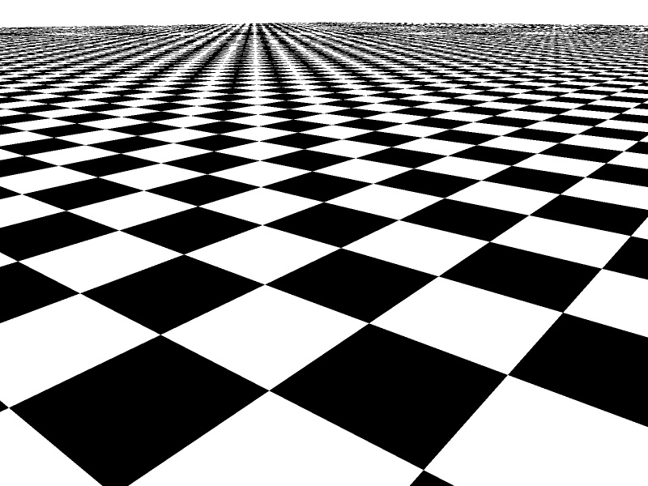

# Practical Assignment 5
**Dealine**: 26.11.2020

Please put your name here:  
**Name:** .......
## Problem 1
### Supersampling (Points 10 + 10 + 10)
In this assignment we will concentrate on stochastic ray-tracin and start with developing samplers, which generate random samples covering a unit square area.

A pixel actually corresponds to a square area. Currently you are sampling the pixels only at their center, which lead to aliasing. As you have learned in the lecture, the most simple way for removing aliasing artifacts from your image is _supersampling_, _i.e._ to shoot more than one ray per pixels. The three most frequently used supersampling strategies are:  

**Regular Sampling:** The Pixel is subdivided into _n = m x m_ equally sized regions, which are sampled in the middle:  
_((i+0.5)/m, (j+0.5)/n)_ for _i,j=[0 .. m-1]_

**Random Sampling:** The Pixel is sampled by _n_ randomly placed samples _e<sub>i</sub> in [0; 1)_  
_(e<sub>i,1</sub>,e<sub>i,2</sub>)_ for _i=[0 .. n-1]_

**Stratified Sampling:** Stratified sampling is a combination of regular and random sampling. One sample is randomly placed in each of the _n = m x m_ regions with _e<sub>i,1</sub>,e<sub>i,2</sub> in [0, 1)_  
_((i+e<sub>i</sub>)/m, (j+e<sub>j</sub>)/m)_ for _i,j=[0 .. m-1]_

In this exercise your task is to implement these sampling strategies:
1. Fork the current repository
2. Modify the README.md file in your fork and put your name above.
3. In the framework you can find an base class ```CSampler``` with the virtual method ```Vec2f getSample(size_t s) const;```, which is supposed to works as follows: _s_ is the sequential number of required sample to be generated. One sample consists of two coordinates (_u_, _v_) that specify a position within a unit square _[0 .. 1) X [0 .. 1)_. Pay extra attention on the difference between member-variable ```size_t m_nSamples``` and returning value of the method ```size_t CSampler::getNumSamples()```.
4. Check how sampler is incorporated in your main loop in **main.cpp** file. Method ```void ICamera::InitRay(Ray& ray, int x, int y, const Vec2f& sample)``` was modified to take an additional parameter - two dimensional sample. The method ```Vec2f CSampler::getSample(size_t)``` returns ```Vec2f::all(0.5f)``` to provide the original functioanlity of the classical ray tracer.
5. Implement the ```getSample()``` methods in **SamplerRegular.h**, **SamplerRandom.h**, and **SamplerStratified.h** which are derived classes from ```CSampler```. You can use method ```random::U<float>()``` to generate a uniform random number in range [0; 1).
Use cb.bmp texture to render your image with 4 samples (2 x 2) and compare them to the following images: (regular) (random) (stratified)

  

## Problem 2
### Area Light (Points 20)
As you have learned in the class, shadows can add important visual information to an image. Until now we have only considered point lights. Point lights create _hard shadows_ because a point light can not be partly occluded and is either blocked or not. To render more realistic shadows we need amore advanced light source. _Area Lights_ are able to produce _soft shadows_ which are more natural. In this exercise we implement a ```CLightArea``` (in **LightArea.h**) which is defined by four points in space:
1. Study the constructor ```CLightArea::CLightArea()```. It takes a pointer to the sampler object, developed in the previouse problem.
2. Implement method ```std::optional<Vec3f>	CLightArea::illuminate(Ray& ray)``` using the random samples as the locations of the _verual_ point light sources at the surface of the LightArea, normal and the area of the LightArea.
    **Hint 1:** You may incorporate a static variable to track the sequence number **_s_** of a sample.
    **Hint 2:** In order to place a virtual point light source you can use method ```void	CLightOmni::setOrigin(const Vec3f& org)```.
3. Modify your shader method ```Vec3f CShaderPhong::shade(const Ray& ray)``` to integrate the incoming light using the sample points as as described in the lecture.
4. Uncomment the code for problem 2 in **main.cpp** and render an image with 4 shadow rays and 4 primary rays per pixel. Play with different samplers and submit your best result in the "renders" folder.
If everything is implemented correct your images should look like this:


## Problem 3
### Stochastic Glossy Reflection (Points 50)

  

## Submission
Please submit the assignment by making a pull request.
**Important** : Please make sure that
- No _extra files_ are submitted (except those, which were mentioned in the assignment)
- The changes were made _only_ in those files where you were asked to write your code
- The Continiouse Integration system (appVeyor) can build the submitted code
- The rendered images are also submitted in the folder "renders" 
